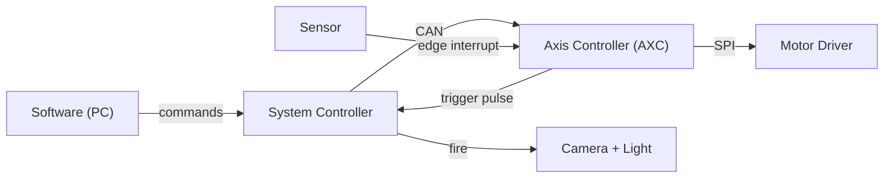
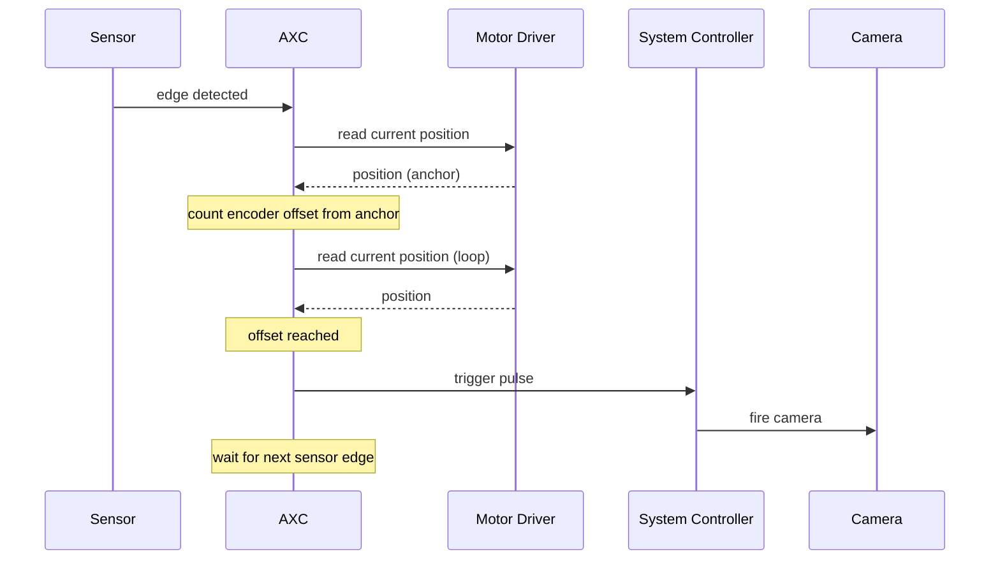

# Hybrid Trigger -- High-Level Design

**Audience:** engineering management review
**Status:** for review
**Date:** May 2026

---

## 1. Purpose

The Axis Controller (AXC) needs to fire the inspection camera at a precisely repeatable position on every web cycle. Today we have two modes and neither is good enough on its own:

- **Sensor mode** -- the camera fires when a physical sensor sees a mark on the web. Simple, but the camera always fires at the sensor's location, not where the inspection optic actually wants it.
- **Encoder mode** -- the camera fires after a fixed amount of motor rotation. Precise, but with no absolute reference; small errors accumulate over a long run.

**Hybrid mode** combines both. The sensor gives an absolute anchor on every web cycle; the encoder measures a precise offset from that anchor to the optic's centre. Each fire is both absolutely referenced and precisely positioned, and any drift is reset on every sensor edge.

---

## 2. System Context

The triggering decision lives entirely in the AXC. The System Controller (SC) translates operator commands into CAN messages and relays the AXC's trigger pulse to the camera. Software does not participate in the per-cycle decision.

---

## 3. Two Operating Modes

Hybrid triggering is exposed as two distinct modes, each suited to a different phase of the workflow:

| | **Inspection** | **One-Shot** |
|---|---|---|
| Use case | Continuous production runs | Setup / calibration |
| Cycling | Continuous (re-arms after every fire) | Single fire, then auto-disables |
| First sensor edge | Skipped (used as the initial anchor only) | Fires the camera |
| On fire | Pulse the camera and re-arm for the next cycle | Stop the reeler in position-hold, pulse the camera, then disable itself |
| Per-part trace count | Yes -- increments the global counter | No |
| Slip / error tracking | Yes | Not applicable |

**Inspection** is the steady-state production mode. Each sensor edge re-anchors the encoder, and the camera fires once the configured offset is reached. The AXC tracks slip / spurious edges in case the web behaves unexpectedly.

**One-Shot** is for setup. The operator commands a single move; on the first sensor edge during that move the AXC stops the web exactly at the trigger position, fires the camera, and disables itself. The web sits still afterwards so the operator can inspect alignment.

---

## 4. How a Trigger Happens

Key behaviours:

- **Anchor on every edge.** Each sensor edge resets the absolute reference, so encoder errors cannot accumulate across cycles.
- **Offset counted in encoder counts.** Software computes the offset from the physical sensor-to-optic distance and the motor's micro-step pitch; the AXC uses it as a single integer.
- **First edge is special.** When Inspection starts, the position of the web relative to the sensor is unknown, so the first edge only records the anchor -- the camera is not fired until the second edge.
- **Slip and spurious detection.** If the encoder distance between two consecutive sensor edges deviates too far from the expected offset, the AXC counts that as an anomaly. After three in a row it logs a warning. The camera is **not** fired on those cycles, and the system re-anchors and recovers automatically on the next valid edge.

---

## 5. Pause and Resume

A new pause capability lets software interrupt a run without losing context.

- **Pause** holds the web mechanically at its current position using the motor driver's position-control mode. The web does not drift, the camera does not fire, and the AXC stops processing sensor edges.
- **Resume** restarts the motor and continues the run. All hybrid state is preserved: the running counter, the slip counter, and the current cycle's anchor. Any sensor edges captured during the pause are discarded so the resume starts cleanly.
- **Pause is not Stop.** Stop is the existing free-rotation halt: it clears the cycle so the next start is a fresh run. Pause is meant to be transient; it is the right operation for a brief operator interruption.
- **One-Shot pause** is mostly a no-op -- if a One-Shot move is already in flight, a pause request is logged and ignored, because the One-Shot itself stops the web on fire.

---

## 6. Firmware Implementation at a Glance

The implementation is contained and reuses existing infrastructure rather than introducing new subsystems.

- One firmware module (`Hybrid_Trigger`) owns the state machine and the trigger decision.
- The sensor interrupt handler is deliberately minimal: it sets a flag and timestamps the edge. All actual work happens in the main loop, where the existing motor-driver SPI access already runs.
- Two new CAN peripherals (one for each mode) and one new CAN operation (Pause) are added. All other commands -- start, stop, set velocity, move-to, move-by, set step size -- reuse existing operations unchanged.
- One new bit is added to the reeler's status flags to track the paused state.
- The camera trigger pin, the CAN reply path, and the motor-driver SPI helpers are reused without modification.
- Slip detection logs a local warning today; the CAN alert back to software is left as a clearly marked placeholder pending agreement on the alert format.
- The legacy encoder-mode trigger code is left in place untouched and will be removed in a follow-up once Hybrid is proven on the bench.

---

## 7. Out of Scope (v2)

These items were considered and explicitly deferred:

- **Trigger-latency compensation** at high web speeds (firing the camera a few micro-steps early to cancel optical-path delay). To be characterised first, then implemented if needed.
- **Sag detection** in firmware. Separate feature; may share sensor infrastructure later.
- **Pinch-roller wear auto-correction.** The error is physical and non-uniform; it cannot be auto-corrected. Periodic operator recalibration is the answer.
- **Slip / spurious CAN alert.** Logged locally for now; the CAN alert format is pending a software / firmware protocol decision.
- **System-Controller firmware changes.** Tracked as a separate work item; the SC team mirrors the AXC contract.

---

## 8. Risks and Mitigations

- **Pinch-roller wear** changes the effective offset over time. No firmware fix is possible; mitigated by periodic operator recalibration.
- **Motor-driver SPI bus contention.** All hybrid SPI access stays in main-loop context, so no new race against the motor-driver bus is introduced.
- **Motor-driver mode transitions during pause.** The pause sequence toggles the driver between motion modes in quick succession. Per the driver datasheet this is supported, but it must be validated on the bench before sign-off.
- **Lost edges during high-frequency bursts.** The interrupt sets a single flag; if two edges arrived between main-loop ticks the second would be coalesced. At realistic web speeds this is well below any plausible rate.

---

## 9. Verification at a Glance

There is no automated test harness for AXC firmware in this project; verification is manual on the target board.

- **Inspection** -- enable, start, exercise multiple cycles, force slip and spurious edges, confirm the warning is logged, confirm normal recovery.
- **One-Shot** -- both edge cases: sensor crossed mid-move (camera fires, web parks) and sensor not crossed (move completes normally, no fire).
- **Pause and Resume** -- pause mid-run, confirm the web holds, confirm sensor edges during pause are discarded, resume and confirm the cycle continues with state preserved.
- **Stop while paused** -- confirm a Stop command from the paused state correctly clears state and leaves the system ready for a fresh start.
- **Diagnostic counters** -- watch-window confirmation that the global count, slip count, mode, and paused flag track the test narrative.

---

## 10. Open Questions for the Software Team

Two items were intentionally left open in this phase and need a decision before related features can ship:

- **Per-part counter ownership and transmission.** Should the AXC keep the count and send it on every fire, or should the SC maintain its own count? Today the AXC keeps it internally and does not transmit.
- **Slip-alert format.** What payload should the AXC send to software when the slip threshold is reached? Until this is agreed, the alert is logged locally only.

---

**End of high-level design.**
