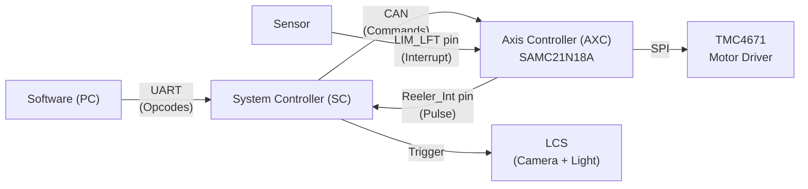
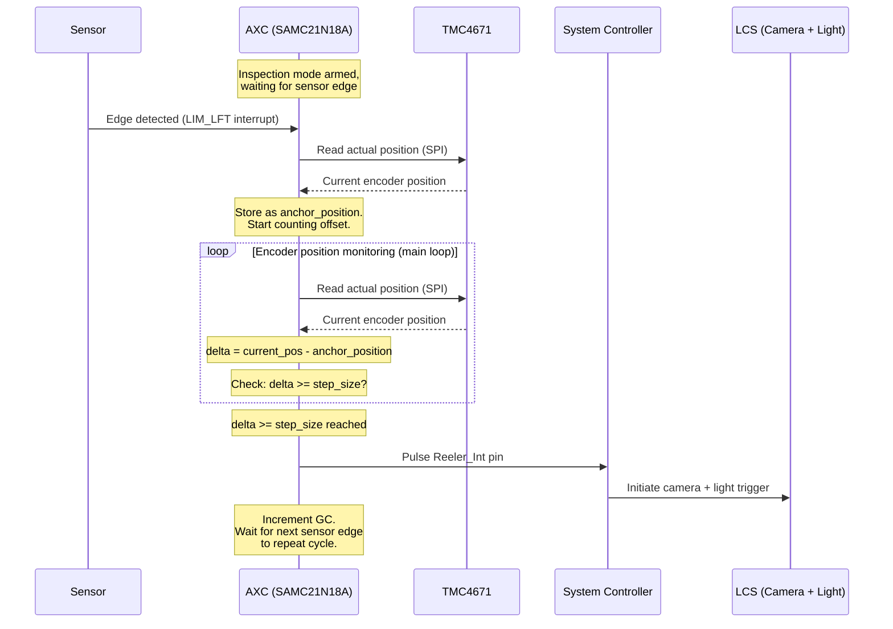
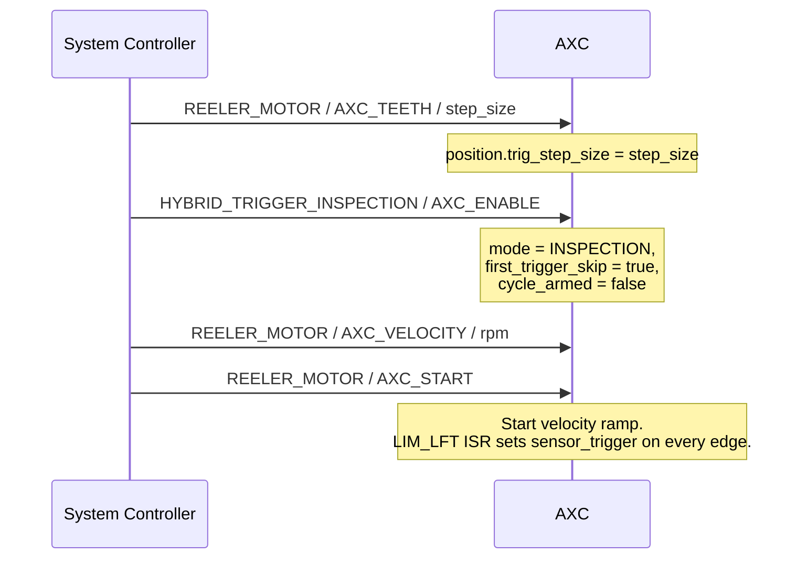

# Hybrid Triggering -- Firmware Design Document

**Date:** May 2026
**Status:** Draft (locked decisions Q1-Q21)

---

## Table of Contents

1. [Overview](#1-overview)
2. [System Context](#2-system-context)
3. [Signal & Data Flow](#3-signal--data-flow)
4. [Command Interface](#4-command-interface)
5. [Initialization & First Trigger](#5-initialization--first-trigger)
6. [Slip & Spurious Trigger Detection](#6-slip--spurious-trigger-detection)
7. [Pause & Resume](#7-pause--resume)
8. [Global Count (GC) Traceability](#8-global-count-gc-traceability)
9. [Future Enhancements](#9-future-enhancements)
10. [Appendix](#10-appendix)
11. [One-Shot Mode](#11-one-shot-mode)

---

## 1. Overview

Hybrid triggering combines **sensor-based absolute position reference** with **encoder-based precise offset counting** to determine exactly when the camera should fire.

In existing firmware, two triggering modes are available:

- **Sensor mode:** The System Controller (SC) directly detects the sensor edge and fires the Light and Camera System (LCS). Simple and direct, but the camera fires at the sensor's physical location rather than at a precisely calculated offset.
- **Encoder mode:** The Axis Controller (AXC) monitors the motor encoder position and fires a trigger every time the position delta reaches the configured step size. Precise, but has no absolute position reference -- drift can accumulate.

**Hybrid mode** addresses both limitations. The sensor provides an absolute anchor point (the physical position where the sensor detects a mark on the web), and the encoder provides the precise positional offset from that anchor to the camera's field of view (FOV) center. This ensures each camera trigger is both absolutely referenced and precisely positioned.

Hybrid triggering is exposed as **two distinct CAN peripherals**:

- **`HYBRID_TRIGGER_INSPECTION` (peripheral 8)** -- Continuous-cycle production mode. Each sensor edge re-anchors the encoder and the AXC fires the camera once the configured offset is reached. Used for inspection runs.
- **`HYBRID_TRIGGER_ONE_SHOT` (peripheral 9)** -- Single-shot mode armed alongside a `MOVE_TO` / `MOVE_BY`. On the first sensor edge during the move, the AXC stops the reeler in position-hold, fires the camera once, and auto-disables. Used for setup and calibration. Replaces the legacy "Configurator" naming used in earlier drafts.

Both modes share the same anchor + offset trigger pipeline. They differ in cycling behavior, RHD (Reach Home Done) reporting, and Global Count handling, all of which are described in the relevant sections below.

---

## 2. System Context

### 2.1 Hardware Topology



### 2.2 Controller Roles in Hybrid Mode

| Controller | Role |
|---|---|
| **SC** | Receives opcodes from software via UART. Translates to CAN commands for AXC. On receiving Reeler_Int pulse, initiates LCS (camera + light). Owns communication with LCS. |
| **AXC** | Receives sensor interrupt on LIM_LFT. Reads motor position from TMC4671 via SPI. Computes positional offset from sensor anchor. Fires Reeler_Int pulse to SC when offset is reached. Owns the triggering decision. |

In hybrid mode, the **triggering decision lives entirely in the AXC**. The SC acts as a relay -- it translates software commands into CAN messages for the AXC and responds to the AXC's Reeler_Int signal by firing the LCS.

---

## 3. Signal & Data Flow

### 3.1 Trigger Pipeline (Inspection)

This is the core path from sensor detection to camera fire during continuous Inspection runs:



### 3.2 Data Elements

| Variable | Type | Description |
|---|---|---|
| `anchor_position` | int32 | Encoder position latched at the sensor edge. Updated every sensor trigger. |
| `step_size` | int32 | Configured positional offset from anchor to camera fire, in micro steps. Computed by SW as `round(sensor_to_FOV_distance / pitch)` and sent as a single integer. |
| `current_pos` | int32 | Encoder position read from TMC4671 during offset counting. |
| `prev_trig_pos` | int32 | Encoder position at the most recent successful trigger. Used for slip / spurious deviation calculation. |
| `consecutive_failures` | uint8 | Count of consecutive slip / spurious events. Reset on successful in-tolerance trigger. Preserved across pause / resume. |
| `cycle_armed` | bool | True between a sensor edge anchor capture and the corresponding camera fire. Inspection mode only. |
| `first_trigger_skip` | bool | True from arming until the first sensor edge has been consumed as an anchor. Inspection mode only. |
| `one_shot_armed` | bool | True between a `MOVE_TO` / `MOVE_BY` command and the One-Shot fire (or the move completing without a sensor edge). One-Shot mode only. |
| `gc` | uint64 | Global Count -- incremented on each successful camera trigger in **Inspection** mode only. |

> **Math note (Q1 decision):** The fractional-accumulator scheme used in earlier drafts is dropped. Re-anchoring at every sensor edge means the at-most-0.5-microstep rounding error in `step_size = round(offset)` does not accumulate across triggers. Each cycle re-references absolute position from the sensor edge.

### 3.3 Mode-Specific Behaviour Summary

| Aspect | Inspection | One-Shot |
|---|---|---|
| **Cycles per arm** | Continuous (re-arms after each fire) | Single (auto-disables after fire) |
| **First-edge handling** | Skipped (anchor only) | Consumed as the trigger edge |
| **On fire** | Pulse Reeler_Int, increment GC, re-arm for next anchor | Pulse Reeler_Int, stop reeler in position-hold, suppress RHD, auto-disable |
| **GC increment** | Yes (+1 per fire) | **No** (Q6) |
| **CAN reply on edge** | None (Reeler_Int pulse only) | None (Q3 -- legacy `AXC_PRESSED` reply removed) |
| **RHD reply on move done** | N/A (no move active) | **Suppressed** if One-Shot fired (`check_move_done = false`) |
| **Slip / spurious tracking** | Active | Not applicable (single shot) |

---

## 4. Command Interface

### 4.1 Commands from SC to AXC (CAN)

These are the commands the SC sends to the AXC to configure and control hybrid triggering. All commands are translated from software opcodes received over UART. Each frame is `data[0]=peripheral`, `data[1]=operation`, `data[2..5]=int32 LE value` (existing AXC convention, DLC=6, EXT_ID).

| Peripheral | Operation | Value | Purpose |
|---|---|---|---|
| `REELER_MOTOR` (1) | `AXC_TEETH` (12) | uint32 step_size | **Existing.** Sets `position.trig_step_size` (in micro steps). SW sends this **before** enabling either hybrid mode. The hybrid pipeline reads `step_size` from this field. |
| `HYBRID_TRIGGER_INSPECTION` (8) | `AXC_ENABLE` (3) | -- | Enable Inspection mode (uses previously stored `position.trig_step_size`). |
| `HYBRID_TRIGGER_INSPECTION` (8) | `AXC_DISABLE` (4) | -- | Disable Inspection mode. |
| `HYBRID_TRIGGER_INSPECTION` (8) | `AXC_PAUSE` (18) | -- | Pause Inspection (preserves all hybrid state). |
| `HYBRID_TRIGGER_ONE_SHOT` (9) | `AXC_ENABLE` (3) | -- | Enable One-Shot mode (uses previously stored `position.trig_step_size`). |
| `HYBRID_TRIGGER_ONE_SHOT` (9) | `AXC_DISABLE` (4) | -- | Disable One-Shot mode. |
| `HYBRID_TRIGGER_ONE_SHOT` (9) | `AXC_PAUSE` (18) | -- | Pause request while One-Shot enabled. **No-op if a One-Shot move is in flight** (Q12); SW must not send in that case. |
| `REELER_MOTOR` (1) | `AXC_VELOCITY` (5) | int32 RPM | **Existing.** Sets target velocity. |
| `REELER_MOTOR` (1) | `AXC_MOVE_TO` (7) | absolute pos | Absolute move (existing). When `HYBRID_TRIGGER_ONE_SHOT` is enabled, also arms the One-Shot edge. |
| `REELER_MOTOR` (1) | `AXC_MOVE_BY` (8) | relative delta | Relative move (existing). When `HYBRID_TRIGGER_ONE_SHOT` is enabled, also arms the One-Shot edge. |
| `REELER_MOTOR` (1) | `AXC_START` (1) | -- | Start motor in velocity ramp. **State-aware (Q9):** if `flags.is_paused == true` resume from paused state; otherwise fresh start (resets Inspection hybrid state if Inspection is the active mode). |
| `REELER_MOTOR` (1) | `AXC_STOP` (2) | -- | Stop motor (free-rotation Stopped). Hybrid Inspection state is reset on stop; mode itself is preserved (mode is owned by the `HYBRID_TRIGGER_*` `AXC_ENABLE`/`AXC_DISABLE` ops only). |
| `REELER_MOTOR` (1) | `AXC_PAUSE` (18) | -- | Pause reeler (TMC4671 position-hold). |

### 4.2 Alerts from AXC to SC (CAN)

| Alert | Description | Status |
|---|---|---|
| **Slip / spurious threshold reached** | Fired when `consecutive_failures >= HYBRID_ALERT_THRESHOLD` (default 3). Intended payload: `failure_count`, `expected_delta`, `actual_delta`. | **Deferred (Q17).** Protocol TBD. Firmware logs via `DBG_Printf` at threshold and leaves a TODO at the would-be `can_Write` site. |

### 4.3 Offset Calculation

The step size (positional offset) is calculated by the software and sent to the AXC as a **single integer** (Q1):

```
step_size = round(sensor_to_FOV_center_distance / pitch)
```

Where:
- `sensor_to_FOV_center_distance` = physical distance from the sensor to the camera FOV center (in mm or the chosen linear unit)
- `pitch` = linear distance per micro step (derived from pinch roller circumference and micro steps per revolution)

The integer is transmitted in `data[2..5]` of the existing `REELER_MOTOR / AXC_TEETH` frame, which writes `position.trig_step_size`. Both hybrid peripherals read their `step_size` from this same field, so SW must send `AXC_TEETH` once before enabling either hybrid mode (or any time the step size changes).

---

## 5. Initialization & First Trigger

### 5.1 Inspection Startup Sequence

When Inspection mode is activated:

1. SC sends `REELER_MOTOR / AXC_TEETH / step_size` -- AXC stores `step_size` in `position.trig_step_size`.
2. SC sends `HYBRID_TRIGGER_INSPECTION / AXC_ENABLE` -- AXC sets `mode = INSPECTION`, `cycle_armed = false`, `first_trigger_skip = true`, `consecutive_failures = 0`, `flags.is_hybrid_trig_enabled = true`.
3. SC sends `REELER_MOTOR / AXC_VELOCITY / rpm`.
4. SC sends `REELER_MOTOR / AXC_START` -- AXC starts the velocity ramp. The LIM_LFT ISR is always armed at boot; it sets `flags.sensor_trigger` on every edge regardless of mode.



### 5.2 First Trigger Skip (Inspection)

The first sensor edge after `AXC_START` is **skipped** -- the AXC records the anchor position but does NOT fire the camera.

**Rationale:** At the moment the reeler starts, the web position relative to the sensor is unknown. The first sensor edge establishes the anchor point. Firing the camera at an unknown offset would produce a spurious trigger.

```c
// In Inspection main-loop tick, on flags.sensor_trigger:
anchor_position = read_tmc4671_actual_pos();
flags.sensor_trigger = false;

if (first_trigger_skip) {
    first_trigger_skip = false;
    cycle_armed = true;            // Anchor captured, start offset counting
    return;                         // Skip -- no camera fire
}

// Normal pipeline: re-anchor and slip / spurious check, then continue offset counting.
```

From the second sensor edge onward, the normal trigger pipeline executes.

### 5.3 One-Shot Startup Sequence

When One-Shot mode is activated:

1. SC sends `REELER_MOTOR / AXC_TEETH / step_size` -- AXC stores `step_size` in `position.trig_step_size`.
2. SC sends `HYBRID_TRIGGER_ONE_SHOT / AXC_ENABLE` -- AXC sets `mode = ONE_SHOT`, `one_shot_armed = false`, `flags.is_hybrid_trig_enabled = true`.
3. SC sends `REELER_MOTOR / AXC_MOVE_TO` or `MOVE_BY` -- the AXC sets `one_shot_armed = true` at the start of the move and proceeds with the existing position-mode handler.

There is no first-trigger skip in One-Shot mode: the very first sensor edge during the armed move is the trigger edge.

---

## 6. Slip & Spurious Trigger Detection

> Applies to **Inspection** mode only. One-Shot mode fires once and disarms, so slip / spurious tracking is not relevant.

### 6.1 Definitions

- **Slip:** The actual encoder delta between two consecutive sensor edges is **significantly larger** than the expected step size. The web moved farther than expected -- a trigger was missed or delayed.
- **Spurious trigger:** The actual encoder delta is **significantly smaller** than expected. Likely sensor noise, bounce, or a false edge -- the web has not moved enough for a legitimate trigger.

### 6.2 Detection Logic

After each sensor edge, the AXC calculates the actual distance traveled since the previous trigger position:

```c
actual_delta   = abs(current_sensor_pos - prev_trig_pos);
expected_delta = step_size;
deviation      = abs(actual_delta - expected_delta);
tolerance      = (step_size * HYBRID_SLIP_TOLERANCE_PCT) / 100u;   // default 5%

if (deviation > tolerance) {
    consecutive_failures++;
    if (consecutive_failures >= HYBRID_ALERT_THRESHOLD) {           // default 3
        DBG_Printf(ERR_LVL_WARN,
                   "[HYB] slip/spurious x%u expected=%ld actual=%ld\n",
                   consecutive_failures, expected_delta, actual_delta);
        // TODO: send CAN alert once protocol is finalised (Q17 -- deferred).
    }
} else {
    consecutive_failures = 0;
}
```

The tolerance is derived from the step size itself (a percentage band).

### 6.3 Recovery

On detecting a slip or spurious trigger, the AXC does **not** attempt to "catch up" or compensate. Instead:

1. **Re-anchor** at the current sensor edge's encoder position.
2. Reset the offset counter (`cycle_armed = true`, anchor updated).
3. Continue the normal pipeline from this new anchor.

This immediate re-anchoring ensures the system recovers within one trigger cycle. The dropped trigger is logged via the consecutive failure count, but the system does not compound errors by attempting retroactive corrections.

### 6.4 Alert Mechanism

The AXC maintains `consecutive_failures`. Each anomaly increments it; each successful in-tolerance trigger resets it to zero. When the counter reaches `HYBRID_ALERT_THRESHOLD` (default 3), the AXC emits a `DBG_Printf` warning. A CAN alert is **deferred** (Q17) until the SC-side protocol is finalised; a `TODO` is left at the firmware site where `can_Write` will eventually be invoked.

The AXC continues operating -- alerts are informational, not halting.

---

## 7. Pause & Resume

Pause and resume are first-class operations (Q7-Q16) implemented across three peripherals: `REELER_MOTOR`, `HYBRID_TRIGGER_INSPECTION`, and `HYBRID_TRIGGER_ONE_SHOT`. The SW sends an `AXC_PAUSE` (op 18) to each peripheral that should pause; the AXC handles them independently.

### 7.1 Reeler Motor Pause (`REELER_MOTOR / AXC_PAUSE`)

This is the motion side of pause. It places the TMC4671 in a hard position-hold so that the web does not drift while paused.

Sequence (from `reeler_Pause_Motor`, per Q8):

1. Switch TMC4671 to **Stopped** mode (TMC `MODE_MOTION = 0`). This is immediate and stops torque output.
2. Read the current encoder position and write it back as `target_position`.
3. Set `velocity_limit` to `HYBRID_PAUSE_HOLD_VELOCITY_RPM` (default 2 RPM) so the position controller cannot lurch.
4. Switch TMC4671 to **Position** mode (TMC `MODE_MOTION = 3`). The controller now actively holds the latched position.
5. Set firmware flags: `vel_timer = false; rotate_vel_mode = false;` (Q13). This short-circuits `run_Velocity_Ramp` and halts Inspection / One-Shot processing in the main loop.
6. Set `flags.is_paused = true` (Q10, bit 11).

Pause does **not** disturb hybrid configuration: `mode`, `step_size`, `anchor_position`, `cycle_armed`, `first_trigger_skip`, `consecutive_failures` (Q16), `gc`, and `one_shot_armed` are all preserved.

> `AXC_STOP` is **not** a pause. Stop performs the existing free-rotation Stopped behavior, clears `is_paused`, and resets the Inspection hybrid state (`cycle_armed = false`, `first_trigger_skip = true`, `consecutive_failures = 0`) while leaving `mode` intact (Q11). Mode is owned exclusively by `HYBRID_TRIGGER_* / AXC_ENABLE | AXC_DISABLE`.

### 7.2 Hybrid Peripheral Pause

`HYBRID_TRIGGER_INSPECTION / AXC_PAUSE` sets `flags.is_paused = true` and freezes all Inspection-side processing. Hybrid state is preserved (Q14, Q16).

`HYBRID_TRIGGER_ONE_SHOT / AXC_PAUSE` is honored only when no One-Shot move is currently in flight. If a move is active, the firmware logs a warning and ignores the request (Q12):

```c
DBG_Printf(ERR_LVL_DEBUG,
           "[HYB] PAUSE on ONE_SHOT ignored - One-Shot move active\n");
```

The SW is expected not to send this case.

### 7.3 Edges During Pause

The LIM_LFT ISR remains mode-blind: it only sets `flags.sensor_trigger = true; time_ms.sens_trig = millis();` (Q18). Any sensor edge that arrives during pause sets the flag, but the main loop does not process it because `vel_timer` and `rotate_vel_mode` are false. On resume, the flag is explicitly cleared so a stale edge captured while paused is discarded (Q14).

### 7.4 Resume (`REELER_MOTOR / AXC_START` while `is_paused == true`)

`AXC_START` is **state-aware** (Q9). If `flags.is_paused == true`, it performs a resume; if false, it performs a fresh start (which resets Inspection hybrid state).

Resume sequence (from `reeler_Start_Motor`):

1. Clear `flags.sensor_trigger` (Q14 -- discard any edge captured while paused).
2. Switch TMC4671 back to **Velocity** mode (`MODE_MOTION = 2`).
3. Restore the velocity ramp from 0 toward the previously configured `velocity.target` (`vel_timer = true; rotate_vel_mode = true;`).
4. Clear `flags.is_paused = false`.

All hybrid state survives resume: `mode`, `step_size`, `anchor_position`, `cycle_armed`, `first_trigger_skip`, `consecutive_failures` (Q16), `gc`, `one_shot_armed`. There is no first-trigger re-skip on resume; the Inspection cycle continues from wherever it was.

There is **no** new `AXC_RESUME` op; resume is signalled solely by `AXC_START` while paused (Q9).

---

## 8. Global Count (GC) Traceability

### 8.1 Specification

| Property | Value |
|---|---|
| **Data type** | `uint64` (8 bytes) |
| **Overflow** | At 1200 parts per minute: overflows in ~59 days. Sufficient for any production run. |
| **Increment** | +1 per successful camera trigger in **Inspection** mode (Q6). Not incremented on skipped, failed, or One-Shot triggers. |
| **Purpose** | Unique per-part identifier for traceability. Each inspected part can be correlated to its GC value. |

### 8.2 Communication

GC is communicated to the software via serial for logging and traceability.

### 8.3 Open Design Question

> **GC Ownership:** Where does the GC counter live -- in the AXC (which owns the trigger decision) or in the SC (which owns the LCS and serial communication)? What is the communication path for GC values?
>
> This decision affects:
> - Whether the AXC needs to send GC over CAN with each trigger, or the SC maintains its own count
> - Synchronization concerns if both controllers track GC independently
> - Serial bandwidth if GC is sent per-trigger over CAN
>
> **To be decided.**

---

## 9. Future Enhancements

These items were identified during design discussions but are **not in scope** for the initial implementation. They are documented here for future reference.

### 9.1 Trigger Latency Compensation

As web velocity increases, there is a non-zero latency between the AXC deciding to fire and the camera actually capturing the image. At higher speeds, this latency translates to a larger positional error.

**Concept:** The AXC could fire the trigger slightly earlier (by a velocity-dependent number of micro steps) to compensate. This requires knowing the system latency characteristics and the current velocity.

**Status:** FUTURE -- document and characterize latency first, then implement compensation if needed.

### 9.2 Sag Detection

During operation, web sag (slack) between the reeler and the inspection area can change. Rather than the software polling for sag status, the firmware could detect sag changes and proactively alert the software.

**Status:** Separate feature. Not part of hybrid triggering, but may share sensor infrastructure.

### 9.3 Pinch Roller Degradation

The pinch roller (diameter ~60mm) is a rubber component that degrades over time, changing its effective circumference. This directly affects the pitch calculation and therefore the step size accuracy.

**Key finding from design discussions:**
- Software **cannot** auto-correct for degradation -- the error is physical and varies non-uniformly
- Degradation can reach up to ~3mm on the rubber portion
- Periodic calibration is required (using a master sample or comparing run data)
- Run data analysis can surface degradation trends as a diagnostic tool

**Status:** No firmware compensation. Periodic recalibration via software tools.

### 9.4 Slip / Spurious CAN Alert

`HYBRID_TRIGGER_INSPECTION` slip / spurious detection currently logs via `DBG_Printf` at the configured threshold. A CAN alert frame back to the SC is **deferred (Q17)** until the SC-side payload format is agreed. A `TODO` block is left in firmware at the future `can_Write` site.

---

## 10. Appendix

### 10.1 Offset Calculation -- Worked Example

**Given:**
- Sensor to camera FOV center distance: 249 mm
- Pinch roller diameter: 60 mm
- Pinch roller circumference: `pi * 60 = 188.496 mm`
- Micro steps per revolution: 65,536 (TMC4671 maps encoder values as 16-bit regardless of the physical encoder resolution)

**Pitch (linear distance per micro step):**
```
pitch = circumference / micro_steps_per_rev
      = 188.496 / 65536
      = 0.002876 mm / micro step
```

**Offset (raw):**
```
offset_raw = sensor_to_FOV_distance / pitch
           = 249 / 0.002876
           = 86572.94 micro steps
```

**Integer step size sent to AXC (Q1):**
```
step_size = round(offset_raw) = 86573
```

**Per-cycle error:** at most 0.5 micro steps `~= 0.0014 mm`. This error does **not** accumulate because every sensor edge re-anchors `anchor_position` to the absolute physical position of the sensor.

### 10.2 Pin Mapping Reference

| Pin Name | Controller | Direction | Function |
|---|---|---|---|
| **LIM_LFT** | AXC | Input (interrupt) | Sensor edge detection. ISR sets `flags.sensor_trigger = true; time_ms.sens_trig = millis();` only -- mode-blind (Q18). |
| **LIM_RT** | AXC | Input (interrupt) | Right limit -- existing functionality, **untouched** by hybrid triggering (Q18). |
| **Reeler_Int** | AXC -> SC | Output (pulse) | Camera trigger signal. AXC pulses this when offset is reached. SC detects edge and fires LCS. |

### 10.3 Mode Comparison

| Aspect | Sensor Mode | Encoder Mode | Hybrid (Inspection) | Hybrid (One-Shot) |
|---|---|---|---|---|
| **Trigger decision** | SC (direct sensor edge) | AXC (position delta) | AXC (sensor anchor + offset) | AXC (sensor anchor + offset, single shot) |
| **Absolute reference** | Yes (sensor) | No | Yes (sensor) | Yes (sensor) |
| **Precise positioning** | No (fires at sensor location) | Yes (step size) | Yes (offset from anchor) | Yes (offset from anchor) |
| **Drift risk** | None | Cumulative | None (re-anchored per sensor edge) | None (single shot) |
| **Sensor required** | Yes | No | Yes | Yes |
| **Cycles per arm** | Continuous | Continuous | Continuous (re-arm after each fire) | Single (auto-disable) |
| **GC increment** | -- | -- | Yes | No (Q6) |

### 10.4 Macro Defaults

| Macro | Default | Purpose |
|---|---|---|
| `HYBRID_SLIP_TOLERANCE_PCT` | `5u` | Tolerance band for slip / spurious detection, as percent of `step_size`. |
| `HYBRID_ALERT_THRESHOLD` | `3u` | `consecutive_failures` value at which the warning is emitted. |
| `HYBRID_PAUSE_HOLD_VELOCITY_RPM` | `2u` | TMC4671 `velocity_limit` (RPM) while in position-hold pause. |

---

## 11. One-Shot Mode

One-Shot mode (`HYBRID_TRIGGER_ONE_SHOT`, peripheral 9) is a single-shot variant of hybrid triggering used for setup and calibration. It replaces the "Configurator" naming used in earlier drafts (Q2). It is functionally distinct from Inspection mode in cycling behavior, RHD reporting, and GC handling.

### 11.1 Use Case

The operator commands the reeler to make a position move (`MOVE_TO` or `MOVE_BY`) with One-Shot armed. Somewhere along that move, the sensor crosses the web mark. On that first sensor edge plus `step_size` of encoder offset, the AXC fires the camera once and parks the reeler. The operator can then visually verify alignment without worrying about the reeler drifting away.

### 11.2 Arming

1. SC: `REELER_MOTOR / AXC_TEETH / step_size` -- stores step size in `position.trig_step_size`.
2. SC: `HYBRID_TRIGGER_ONE_SHOT / AXC_ENABLE` -- AXC sets `mode = ONE_SHOT`, `flags.is_hybrid_trig_enabled = true`, `one_shot_armed = false`.
2. SC: `REELER_MOTOR / AXC_MOVE_TO` (or `AXC_MOVE_BY`) -- AXC starts the position move via existing `reeler_Move`. At the start of the move, with One-Shot enabled, the firmware sets `one_shot_armed = true`.

### 11.3 Edge Sequence (Q4)

When `flags.sensor_trigger` is observed during an armed One-Shot move, in this order:

1. **Stop reeler with position hold.** Call `reeler_Pause_Motor` to put the TMC4671 into Stopped -> position-hold @ `HYBRID_PAUSE_HOLD_VELOCITY_RPM` -> Position mode. The web stops dead at the trigger position.
2. **Fire camera.** Pulse Reeler_Int (`trigger_Camera_Line`) so the SC fires the LCS.
3. **Suppress RHD.** Set `check_move_done = false` so the move-complete handler does not send the existing `AXC_HOMING`-style RHD reply for this aborted move.
4. **Auto-disable.** Clear `flags.is_hybrid_trig_enabled` and `one_shot_armed`. Restore `mode` to `INSPECTION` only on the next `HYBRID_TRIGGER_INSPECTION / AXC_ENABLE`; do not implicitly fall back here.

The reeler stays in position-hold (the pause path leaves `flags.is_paused = true`). It exits hold only on the next `MOVE_TO`/`MOVE_BY` (which clears the hold by initiating a new position move) or `AXC_START` (which performs the state-aware resume / fresh-start logic per Q9, then begins a velocity ramp) (Q5).

There is **no CAN reply sent on the One-Shot edge** (Q3). The legacy `AXC_PRESSED` (op 14) reply that earlier drafts described is removed.

### 11.4 GC

One-Shot fires do **not** increment `gc` (Q6). GC is reserved for Inspection production traceability.

### 11.5 Pause Interaction

`HYBRID_TRIGGER_ONE_SHOT / AXC_PAUSE` while a One-Shot move is in flight is logged and ignored (Q12). SW is expected not to send in this case. Pausing One-Shot before `MOVE_TO` / `MOVE_BY` is a no-op on the motion side and only sets `flags.is_paused`; the next `MOVE_TO` will clear it implicitly via the existing motion-start path.

### 11.6 Move Completes Without Sensor Edge

If the move completes before any sensor edge (e.g., the operator picked too short a target), the existing RHD reply fires normally and `one_shot_armed` is cleared. The mode itself remains `ONE_SHOT` until the SC sends another `HYBRID_TRIGGER_ONE_SHOT / AXC_DISABLE` or a different `HYBRID_TRIGGER_*` `AXC_ENABLE`.

---

## Appendix A. Decision Log (Q1-Q21)

Locked decisions from the design Q&A that shaped this document. Cross-referenced inline.

| # | Decision |
|---|---|
| Q1 | Drop fractional-accumulator scheme. SW sends a single integer `step_size = round(offset)`. Re-anchoring per sensor edge bounds the error. |
| Q2 | Rename `CONFIGURATOR` -> `ONE_SHOT` everywhere (enum, peripheral name, `cfg_armed` -> `one_shot_armed`, function names, docs). Enum value remains 9. |
| Q3 | One-Shot does not send `AXC_PRESSED` (op 14) reply. Remove legacy reply helper. |
| Q4 | One-Shot edge sequence: stop reeler with position hold -> fire camera -> suppress RHD -> auto-disable. |
| Q5 | One-Shot fire leaves motor in position-hold; exits only on next `MOVE_TO` / `MOVE_BY` or `AXC_START`. |
| Q6 | One-Shot does **not** increment `gc`. GC is Inspection-only. |
| Q7 | `AXC_PAUSE = 18`. Sent on `REELER_MOTOR`, `HYBRID_TRIGGER_INSPECTION`, `HYBRID_TRIGGER_ONE_SHOT` independently. |
| Q8 | Pause mechanism: TMC4671 -> Stopped -> set `target = actual` and `velocity_limit ~= 2 RPM` -> Position mode. |
| Q9 | `AXC_START` is state-aware: if `is_paused` resume; else fresh start. No new `AXC_RESUME` op. |
| Q10 | Add `flags.is_paused : 1` at bit 11 in `Motor_Info_t.flags`. Set by `reeler_Pause_Motor`. Cleared by `reeler_Start_Motor` and `reeler_Stop_Motor`. |
| Q11 | `AXC_STOP` while paused: free-rotation Stopped, hybrid Inspection state reset, `mode` preserved, `is_paused = false`. |
| Q12 | `HYBRID_TRIGGER_ONE_SHOT / AXC_PAUSE` during a One-Shot move: log warning, no-op. |
| Q13 | Pause sets `vel_timer = false; rotate_vel_mode = false;` to short-circuit ramp and hybrid checks. |
| Q14 | Edges seen during pause are discarded by Resume (clear `flags.sensor_trigger`). ISR is mode-blind. |
| Q15 | Resume: TMC -> Velocity mode; ramp from 0 to previously SW-set `velocity.target`. |
| Q16 | `consecutive_failures` is **preserved** across pause / resume. |
| Q17 | Slip / spurious CAN alert deferred (protocol TBD). `DBG_Printf` at threshold; `TODO` at the future `can_Write` site. |
| Q18 | LIM_LFT is the hybrid sensor. LIM_RT untouched. ISR trimmed to `flags.sensor_trigger = true; time_ms.sens_trig = millis();` only. |
| Q19 | Doc edits go to `Hybrid_Triggering_Firmware_Design - Copy.md` only. The older `Hybrid_Triggering_Firmware_Design.md` is left untouched. |
| Q20 | Pin symbol in design doc is `LIM_LFT` to match the firmware project. |
| Q21 | TMC4671 datasheet sections cited: section 4.7.5 (PI clipping), 4.7.8 (P position controller), 4.7.11 (motion modes), 6.5 (modes of operation). |
