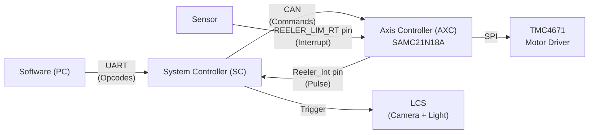
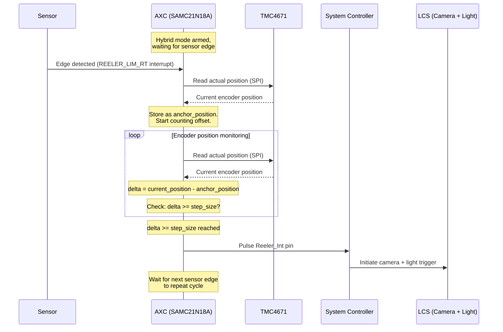
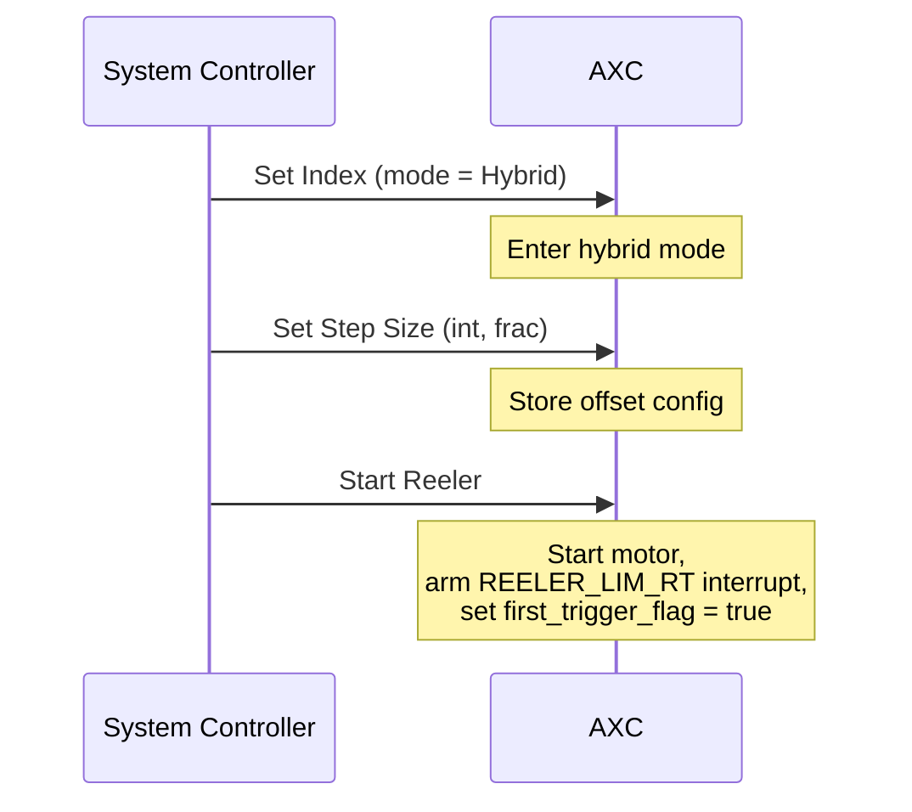

# Hybrid Triggering — Firmware Design Document

**Date:** March 2026
**Status:** Draft

---

## Table of Contents

1. [Overview](#1-overview)
2. [System Context](#2-system-context)
3. [Signal & Data Flow](#3-signal--data-flow)
4. [Command Interface](#4-command-interface)
5. [Initialization & First Trigger](#5-initialization--first-trigger)
6. [Slip & Furious Trigger Detection](#6-slip--furious-trigger-detection)
7. [Pause & Resume](#7-pause--resume)
8. [Global Count (GC) Traceability](#8-global-count-gc-traceability)
9. [Future Enhancements](#9-future-enhancements)
10. [Appendix](#10-appendix)

---

## 1. Overview

Hybrid triggering combines **sensor-based absolute position reference** with **encoder-based precise offset counting** to determine exactly when the camera should fire.

In existing firmware, two triggering modes are available:

- **Sensor mode:** The System Controller (SC) directly detects the sensor edge and fires the Light and Camera System (LCS). Simple and direct, but the camera fires at the sensor's physical location rather than at a precisely calculated offset.
- **Encoder mode:** The Axis Controller (AXC) monitors the motor encoder position and fires a trigger every time the position delta reaches the configured step size. Precise, but has no absolute position reference — drift can accumulate.

**Hybrid mode** addresses both limitations. The sensor provides an absolute anchor point (the physical position where the sensor detects a mark on the web), and the encoder provides the precise positional offset from that anchor to the camera's field of view (FOV) center. This ensures each camera trigger is both absolutely referenced and precisely positioned.

Hybrid mode is introduced as a new mode value within the existing `set index` op code.

---

## 2. System Context

### 2.1 Hardware Topology



### 2.2 Controller Roles in Hybrid Mode

| Controller | Role |
|---|---|
| **SC** | Receives opcodes from software via UART. Translates to CAN commands for AXC. On receiving Reeler_Int pulse, initiates LCS (camera + light). Owns communication with LCS. |
| **AXC** | Receives sensor interrupt on REELER_LIM_RT. Reads motor position from TMC4671 via SPI. Computes positional offset from sensor anchor. Fires Reeler_Int pulse to SC when offset is reached. Owns the triggering decision. |

In hybrid mode, the **triggering decision lives entirely in the AXC**. The SC acts as a relay — it translates software commands into CAN messages for the AXC and responds to the AXC's Reeler_Int signal by firing the LCS.

---

## 3. Signal & Data Flow

### 3.1 Trigger Pipeline

This is the core path from sensor detection to camera fire:



### 3.2 Data Elements

| Variable | Type | Description |
|---|---|---|
| `anchor_position` | int32 | Encoder position latched at the sensor edge. Updated every sensor trigger. |
| `step_size_int` | uint16 | Integer part of the configured positional offset (in micro steps). |
| `step_size_frac` | uint16 | Fractional part of the offset (fixed-point, e.g., 1/65536ths of a micro step). |
| `frac_accumulator` | uint16 | Running sum of fractional remainders. When this overflows (>= 1.0), an extra micro step is added. |
| `current_position` | int32 | Encoder position read from TMC4671 during offset counting. |
| `consecutive_failures` | uint8 | Count of consecutive slip/furious trigger events. Reset on successful trigger. |
| `gc` | uint64 | Global Count — incremented on each successful camera trigger. |

### 3.3 Fractional Accumulator

The positional offset (step size) from sensor to camera FOV center may not be an exact integer number of micro steps. Rather than rounding and accepting cumulative drift, the AXC uses a fractional accumulator to distribute the sub-micro-step error evenly across triggers.

**Pseudocode:**

```
// Configuration (received from SC via CAN)
step_size_int   = <integer micro steps>
step_size_frac  = <fractional part, fixed-point uint16>

// State (persistent across triggers)
frac_accumulator = 0

// On each trigger cycle:
function compute_effective_step_size():
    frac_accumulator += step_size_frac

    if frac_accumulator >= FRAC_SCALE:    // FRAC_SCALE = 65536 (or chosen fixed-point base)
        frac_accumulator -= FRAC_SCALE
        return step_size_int + 1          // Add one extra micro step this cycle
    else:
        return step_size_int              // Normal step size
```

**Example:** If the true offset is 142.3 micro steps:
- `step_size_int = 142`, `step_size_frac = 0.3 * 65536 = 19661`
- Triggers 1-3: effective step = 142 (accumulator: 19661, 39322, 58983)
- Trigger 4: accumulator overflows (58983 + 19661 = 78644 >= 65536), effective step = 143, accumulator resets to 78644 - 65536 = 13108
- Over many triggers, the average step size converges to 142.3

---

## 4. Command Interface

### 4.1 Commands from SC to AXC (CAN)

These are the commands the SC sends to the AXC to configure and control hybrid triggering. All commands are translated from software opcodes received over UART.

| Command | Description | Parameters |
|---|---|---|
| **Set Index** | Selects the triggering mode. Hybrid is a new mode value alongside Sensor and Encoder. | `mode`: Sensor / Encoder / **Hybrid** |
| **Set Step Size** | Configures the positional offset from sensor anchor to camera trigger point. | `step_size_int` (uint16): integer micro steps<br/>`step_size_frac` (uint16): fractional part |
| **Set Reeler Velocity** | Sets the target velocity for the reeler motor. | `velocity` (int32): target velocity |
| **Move To** | Commands an absolute position move. | `position` (int32): target position |
| **Move By** | Commands a relative position move. | `delta` (int32): relative distance |
| **Start Reeler** | Starts the reeler motor and arms the hybrid trigger pipeline. | — |
| **Stop Reeler** | Stops the reeler motor and disarms the trigger pipeline. | — |

### 4.2 Alerts from AXC to SC (CAN)

| Alert | Description | Payload |
|---|---|---|
| **Slip/Furious Alert** | Sent when consecutive failure count reaches the configured threshold. | `failure_count` (uint8), `last_expected_delta`, `last_actual_delta` |

### 4.3 Offset Calculation

The step size (positional offset) is calculated by the software and sent to the AXC. The formula:

```
offset = sensor_to_FOV_center_distance / pitch
```

Where:
- `sensor_to_FOV_center_distance` = physical distance from the sensor to the camera FOV center (in mm or the chosen linear unit)
- `pitch` = linear distance per micro step (derived from pinch roller circumference and steps/revolution)

The result is split into `step_size_int` (integer part) and `step_size_frac` (fractional part) before being sent to the AXC.

---

## 5. Initialization & First Trigger

### 5.1 Startup Sequence

When hybrid mode is activated:

1. SC sends `Set Index (Hybrid)` → AXC enters hybrid mode
2. SC sends `Set Step Size (int, frac)` → AXC stores the offset configuration
3. SC sends `Start Reeler` → AXC starts motor and **arms the sensor interrupt**



### 5.2 First Trigger Skip

The first sensor edge after `Start Reeler` is **skipped** — the AXC records the anchor position but does NOT fire the camera.

**Rationale:** At the moment the reeler starts, the web position relative to the sensor is unknown. The first sensor edge establishes the anchor point. Firing the camera at an unknown offset would produce a furious trigger (camera fires at wrong position).

```
// In sensor ISR:
on_sensor_edge():
    anchor_position = read_tmc4671_position()

    if first_trigger_flag:
        first_trigger_flag = false
        return                          // Skip — anchor recorded, no camera fire

    // Normal pipeline: start counting offset from anchor_position
    effective_step = compute_effective_step_size()
    arm_offset_counter(anchor_position, effective_step)
```

From the second sensor edge onward, the normal trigger pipeline executes.

---

## 6. Slip & Furious Trigger Detection

### 6.1 Definitions

- **Slip:** The actual encoder delta between two consecutive sensor edges is **significantly larger** than the expected step size. This means the web moved farther than expected — a trigger was "missed" or delayed.
- **Furious trigger:** The actual encoder delta is **significantly smaller** than expected. This could be caused by sensor noise, bounce, or a false edge — the web hasn't moved enough for a legitimate trigger.

### 6.2 Detection Logic

After each sensor edge, the AXC calculates the actual distance traveled since the last anchor:

```
actual_delta = abs(current_sensor_position - previous_anchor_position)
expected_delta = step_size_int   // (simplified; effective step size with fractional correction)

deviation = abs(actual_delta - expected_delta)

if deviation > tolerance:
    // Anomaly detected
    consecutive_failures++

    if consecutive_failures >= alert_threshold:   // default: 3
        send_can_alert(SLIP_FURIOUS, consecutive_failures, expected_delta, actual_delta)
else:
    consecutive_failures = 0   // Reset on success
```

The `tolerance` is derived from the step size itself. It defines the acceptable deviation band — triggers within this band are considered valid.

### 6.3 Recovery

On detecting a slip or furious trigger, the AXC does **not** attempt to "catch up" or compensate. Instead:

1. **Re-anchor** at the current sensor edge's encoder position
2. Reset the offset counter
3. Continue the normal pipeline from this new anchor

This immediate re-anchoring ensures the system recovers within one trigger cycle. The dropped trigger is logged (via consecutive failure count), but the system does not compound errors by attempting retroactive corrections.

```
// On anomaly:
anchor_position = current_sensor_position   // Re-anchor here
// Normal pipeline resumes from new anchor
```

### 6.4 Alert Mechanism

The AXC maintains a `consecutive_failures` counter. Each anomaly increments it; each successful trigger resets it to zero. When the counter reaches the configured threshold (default: 3), the AXC sends a CAN alert message to the SC containing:

- Current failure count
- Expected delta (step size)
- Actual measured delta

The SC can relay this to the software for operator notification. The AXC continues operating — alerts are informational, not halting.

---

## 7. Pause & Resume

### 7.1 Pause

When the system is paused (e.g., operator pause or software command):

- The reeler motor stops
- The AXC **retains the current encoder position in memory**
- The trigger pipeline is disarmed (sensor interrupt remains configured but triggers are not processed)
- The fractional accumulator and GC are preserved

### 7.2 Resume

On resume:

- The reeler motor restarts
- The AXC **treats the next sensor edge as a re-initialization** — the first trigger skip logic applies (Section 5.2)
- The `first_trigger_flag` is set to `true`
- The fractional accumulator is **not** reset (to maintain long-term offset accuracy)
- GC continues from its previous value

This ensures the system re-establishes a valid anchor point after any pause, avoiding position uncertainty.

---

## 8. Global Count (GC) Traceability

### 8.1 Specification

| Property | Value |
|---|---|
| **Data type** | `uint64` (8 bytes) |
| **Overflow** | At 1200 parts per minute: overflows in ~59 days. Sufficient for any production run. |
| **Increment** | +1 per successful camera trigger (not incremented on skipped or failed triggers) |
| **Purpose** | Unique per-part identifier for traceability. Each inspected part can be correlated to its GC value. |

### 8.2 Communication

GC is communicated to the software via serial for logging and traceability.

### 8.3 Open Design Question

> **GC Ownership:** Where does the GC counter live — in the AXC (which owns the trigger decision) or in the SC (which owns the LCS and serial communication)? What is the communication path for GC values?
>
> This decision affects:
> - Whether the AXC needs to send GC over CAN with each trigger, or the SC maintains its own count
> - Synchronization concerns if both controllers track GC independently
> - Serial bandwidth if GC is sent per-trigger over CAN
>
> **To be decided.**

---

## 9. Future Enhancements

These items were identified during design discussions but are **not in scope** for the initial implementation. They are documented here for future reference.

### 9.1 Trigger Latency Compensation

As web velocity increases, there is a non-zero latency between the AXC deciding to fire and the camera actually capturing the image. At higher speeds, this latency translates to a larger positional error.

**Concept:** The AXC could fire the trigger slightly earlier (by a velocity-dependent number of micro steps) to compensate. This requires knowing the system latency characteristics and the current velocity.

**Status:** FUTURE — document and characterize latency first, then implement compensation if needed.

### 9.2 Sag Detection

During operation, web sag (slack) between the reeler and the inspection area can change. Rather than the software polling for sag status, the firmware could detect sag changes and proactively alert the software.

**Status:** Separate feature. Not part of hybrid triggering, but may share sensor infrastructure.

### 9.3 Pinch Roller Degradation

The pinch roller (diameter ~60mm) is a rubber component that degrades over time, changing its effective circumference. This directly affects the pitch calculation and therefore the step size accuracy.

**Key finding from design discussions:**
- Software **cannot** auto-correct for degradation — the error is physical and varies non-uniformly
- Degradation can reach up to ~3mm on the rubber portion
- Periodic calibration is required (using a master sample or comparing run data)
- Run data analysis can surface degradation trends as a diagnostic tool

**Status:** No firmware compensation. Periodic recalibration via software tools.

---

## 10. Appendix

### 10.1 Offset Calculation — Worked Example

**Given:**
- Sensor to camera FOV center distance: 150 mm
- Pinch roller diameter: 60 mm
- Pinch roller circumference: `π × 60 = 188.496 mm`
- Motor steps per revolution: 200
- Micro steps per step: 256
- Total micro steps per revolution: `200 × 256 = 51,200`

**Pitch (linear distance per micro step):**
```
pitch = circumference / micro_steps_per_rev
      = 188.496 / 51200
      = 0.003681 mm/micro step
```

**Offset:**
```
offset = sensor_to_FOV_distance / pitch
       = 150 / 0.003681
       = 40,750.34 micro steps
```

**Split into integer and fractional:**
- `step_size_int = 40750`
- `step_size_frac = 0.34 × 65536 = 22282` (fixed-point uint16)

**Fractional accumulator behavior:**
- Every trigger: accumulator += 22282
- After 3 triggers: accumulator = 66846 → overflow → effective step = 40751, accumulator = 66846 - 65536 = 1310
- Net effect: every ~3 triggers, one extra micro step is added, keeping average offset at 40750.34

### 10.2 Pin Mapping Reference

| Pin Name | Controller | Direction | Function |
|---|---|---|---|
| **REELER_LIM_RT** | AXC | Input (interrupt) | Sensor edge detection. Triggers ISR on rising/falling edge. |
| **Reeler_Int** | AXC → SC | Output (pulse) | Camera trigger signal. AXC pulses this when offset is reached. SC detects edge and fires LCS. |

### 10.3 Mode Comparison

| Aspect | Sensor Mode | Encoder Mode | Hybrid Mode |
|---|---|---|---|
| **Trigger decision** | SC (direct sensor edge) | AXC (position delta) | AXC (sensor anchor + offset) |
| **Absolute reference** | Yes (sensor) | No | Yes (sensor) |
| **Precise positioning** | No (fires at sensor location) | Yes (step size) | Yes (offset from anchor) |
| **Drift risk** | None | Cumulative | None (re-anchored per sensor edge) |
| **Sensor required** | Yes | No | Yes |
| **Signal path** | Sensor → SC → LCS | AXC → SC → LCS | Sensor → AXC → SC → LCS |
